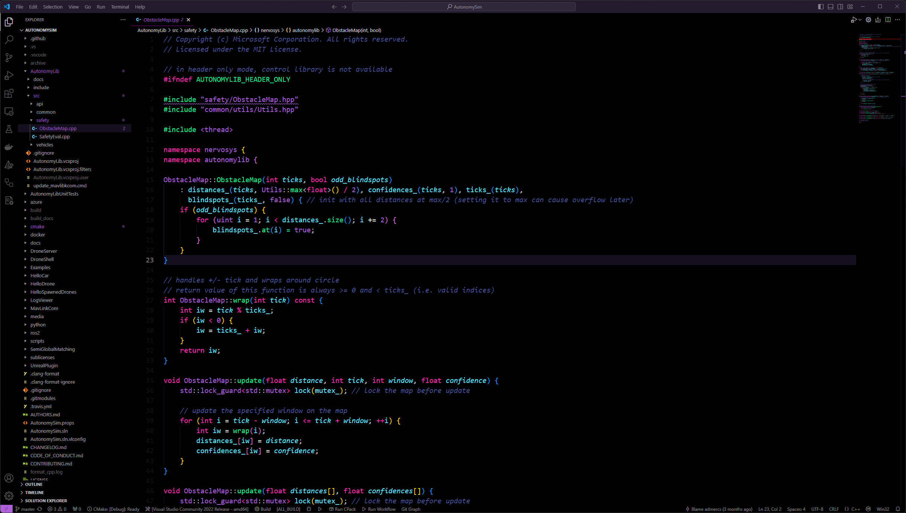

# Fluoresynth color theme for Visual Studio Code

Pronunciation: _fluorescenth_

A flourescent-on-black color theme extension for Visual Studio (VS) Code based on FluoroMachine and SynthWave'84.



## Installation

```bash
code --install-extension fluoresynth-1.0.1.vsix
```

## Build from Source

```bash
npm install -g @vscode/vsce
vsce package
```

## License

MIT License
